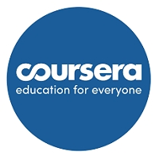

 

# Coursera Bioinformatics Introduction and Methods

**Bioinformatics : Introduction and Methods 生物信息学: 导论与方法** - *Peking University*

<audio src="2019年北京欢迎你 chorus (DJ舞曲).mp3" controls></audio>

## Content

1) Week 1 : Introduction and History of Bioinformatics
    
    a) What is Bioinformatics
        
        - 動畫 : [What is Bioinformatics](https://www.youtube.com/watch?v=bHWG58UFHQM&t=2s)
        
    b) History of Bioinformatics
        
        - 動畫 : [History of Bioinformatics](https://www.youtube.com/watch?v=U44CO6USg1c&t=9s)
        
    c) Overview of Bioinformatics in China and About This Course
        
        - 動畫 : [Bioinformatics in Mainland China](https://www.youtube.com/watch?v=UyvS8l1Fkq4&t=2s)
        - 動畫 : [About This Course](https://www.youtube.com/watch?v=7o-yReHU72g)
        
    d) Review
        
        - テスト : Introduction and History of Bioinformatics
        
    e) Supplementary
        
        - 學習用教材 : Reading
        - 學習用教材 : Slides
        

2) Week 2 : Sequence Alignment
    
    a) Sequence Alignment, Part I
        
        - 動畫 : [Essential Concepts](https://www.youtube.com/watch?v=5HstY6ANiUo)
        - 動畫 : [Global Alignment by Dynamic Programming](https://www.youtube.com/watch?v=9D-JXUaC_m8)
        
    b) Sequence Alignment, Part II
        
        - 動畫 : [From Global to Local](https://www.youtube.com/watch?v=m2wa84YU9zA&t=1s)
        - 動畫 : [Alignment with Affine Gap Penalty and Calculation of Time Complexity of The Needleman-Wunsch Algorithm](https://www.youtube.com/watch?v=DQQ_q2dn2ds&t=1s)
        
    c) Interview with M. S. Waterman Waterman
        
        - 動畫 : [Interview with M. S. Waterman Waterman](https://www.youtube.com/watch?v=3vf77ux5raE&t=1s)
        
    d) Supplemental Lectures and Presentations
        
        - 動畫 : [Supplement on Homology & Similarity, Similarity Matrix and Dot Matrix (English Subtitles)](https://www.youtube.com/watch?v=QwggTEUUZ0U)
        - 動畫 : [Student Presentation (English Subtitles)](https://www.youtube.com/watch?v=9qeakCA2Bd4&t=2s)
        - 學習用教材 : Reading
        - 學習用教材 : Slides
        
    e) Review
        
        - テスト : Sequence Alignment
        

3) Week 3 : Sequence Database Search
    
    a) Sequence Database Search
        
        - 動画 : [講座Sequence Databases](https://www.youtube.com/watch?v=ZxtNQ7_RiJc&t=1s)
        - 動画 : [講座BLAST Algorithm: A Primer](https://www.youtube.com/watch?v=XWZDjtJzsk4&t=2s)

    b) Student Presentation
        
        - 動画 : [講座Student Presentation (English Subtitles)](https://www.youtube.com/watch?v=VrKZSRcTKks&t=2s)
        
    c) Review
        
        - テスト : Sequence Database Search
        
    d) Supplementary
        
        - 学習用教材 : Readings
        - 学習用教材 : Slides
        

4) Week 4 : Markov Model
    
    a) Markov Model
        
        - 動画 : [講座From States to Markov Chain](https://www.youtube.com/watch?v=cNgkLPZ8qMU&t=3s)
        - 動画 : [講座Hidden Markov Model](https://www.youtube.com/watch?v=Xmr6pVBotKk&t=2s)
        - 動画 : [講座Predict with Hidden Markov Model](https://www.youtube.com/watch?v=-sfu9Wie-Kc&t=2s)
        
    b) Student Presentation
        
        - 動画 : [講座Student Presentation](https://www.youtube.com/watch?v=gH66yj4gS60&t=4s)
        
    c) Review
        
        - テスト : Markov Model
        
    d) Supplementary
        
        - 学習用教材 : Readings
        - 学習用教材 : Slides

5) Week 5 : Next Generation Sequencing (NGS): Mapping of Reads From Resequencing and Calling of Genetic Variants
    
    a) Next Generation Sequencing (NGS)
    
        - 動画 : [講座From Sequencing to NGS](https://www.youtube.com/watch?v=nkjZn8G898Y&t=4s)
        - 動画 : [講座Reads Mapping and Variants Calling](https://www.youtube.com/watch?v=cp1ZtdBh0oA&t=6s)
        - 動画 : [講座Computer Lab : Reads mapping and variant calling (English Subtitles)](https://www.youtube.com/watch?v=uqbDQbz-4xY&t=3s)
        
    b) Supplemental Lectures
        
        - 動画 : [講座Supplement on reads mapping and variant calling (English Subtitles)](https://www.youtube.com/watch?v=KP__HatzSCw&t=2s)
        - 動画 : [講座Supplement on genotyping (English Subtitles)](https://www.youtube.com/watch?v=4UrrW1XQshI&t=3s)
        - 動画 : [講座A quick tour to sequencer 1 - Ion Torrent PGM (English Subtitles)](https://www.youtube.com/watch?v=pAzWqhdenCg&t=3s)
        - 動画 : [講座A quick tour to sequencer 2 - 3730 Sanger sequencing (English Subtitles)](https://www.youtube.com/watch?v=GujCwnX2Geg&t=2s)
        
    c) Student Presentation
        
        - 動画 : [講座Student presentation (English Subtitles)](https://www.youtube.com/watch?v=mK8GgY2zqGc&t=3s)
        
    d) Review
        
        - テスト : Next Generation Sequencing (NGS)
        
    e) Supplementary
        
        - 学習用教材 : Readings
        - 学習用教材 : Slides
        

6) Week 6 : Functional Prediction of Genetic Variants
    
    a) Variant Databases
        
        - 動画 : [講座Overview of the Problem](https://www.youtube.com/watch?v=tN7N7kynNPg&t=2s)
        - 動画 : [講座Variant Databases](https://www.youtube.com/watch?v=H51VFxjE0gY&t=3s)
        
    b) Predicting Methods
        
        - 動画 : [講座Conservation-Based and Rule-Based Methods : SIFT & PolyPhen](https://www.youtube.com/watch?v=qnl7h64XY6o&t=2s)
        - 動画 : [講座Classifier-Based Methods : SAPRED](https://www.youtube.com/watch?v=yNUjQ0Z6QUc&t=2s)
        
    c) Supplemental Lectures
        
        - 動画 : [講座Introduction to Support Vector Machine(SVM) (English Subtitles)](https://www.youtube.com/watch?v=KA7b9i04i6U&t=1s)
        
    d) Student Presentation
        
        - 動画 : [講座Student presentation (English Subtitles)](https://www.youtube.com/watch?v=ffYKrPmBTR4&t=2s)
        
    e) Review
        
        - テスト : Functional Prediction of Genetic Variants
        
    f) Supplementary
        
        - 学習用教材 : Readings
        - 学習用教材 : Slides

7) Week 7 : Mid-term Exam
    

8) Week 8 : Next Generation Sequencing : Transcriptome Analysis, and RNA-Seq
    
    a) Next Generation Sequencing : Transcriptome Analysis, and RNA-Seq
        
        - 動画 : [講座Transcriptome : An Overview](https://www.youtube.com/watch?v=yM08bBHQg9E&t=2s)
        - 動画 : [講座RNA-Seq : Mapping & Assembling](https://www.youtube.com/watch?v=8i_X9WLRVUo&t=2s)
        - 動画 : [講座Computer Lab : RNA-seq Data Analysis RNA-seq (English Subtitles)](https://www.youtube.com/watch?v=eWmNR4rz-es&t=3s)
        
    b) Supplemental Lectures
        
        - 動画 : [講座Dr. Maynard Olson Talk](https://www.youtube.com/watch?v=w5Xtfm9p5F4&t=2s)
        
    c) Student Presentation
        
        - 動画 : [講座Student presentation (English Subtitles)](https://www.youtube.com/watch?v=7wv9d0XfRaY&t=1s)
        

9) Week 9 : Prediction and Analysis of Noncoding RNA
    
    a) Prediction and Analysis of Noncoding RNA
        
        - 動画 : [講座From Information to Knowledge](https://www.youtube.com/watch?v=GwfhclNpWT0&t=10s)
        - 動画 : [講座Data Mining : Identify long ncRNAs](https://www.youtube.com/watch?v=MKAxaIrsxpc&t=4s)
        - 動画 : [講座Data Mining : Differential Expression and Clustering](https://www.youtube.com/watch?v=hrnoTtEr8A8)
        
    b) Supplemental Lectures
        
        - 動画 : [講座Feature selection and Clustering (English Subtitles)](https://www.youtube.com/watch?v=aCsvoQIoFhk)
        - 動画 : [講座A quick tour to sequencer - illumina HiSeq & MiSeq (English Subtitles)](https://www.youtube.com/watch?v=ZWJAQsgGDLE)
        
    c) Student Presentation
        
        - 動画 : [講座Student Presentation (English Subtitles)](https://www.youtube.com/watch?v=ORmKN86Fqe4)
        
    d) Review
        
        - テスト : Prediction and Analysis of Noncoding RNA
        
    e) Supplementary
        
        - 学習用教材 : Readings
        - 学習用教材 : Slides

10) Week 10 : Ontology and Identification of Molecular Pathways
    
    a) Ontology, Gene Ontology and KEGG Pathway Database
        
        - 動画 : [講座Ontology and Gene Ontology](https://www.youtube.com/watch?v=lWTrrSZrLxs&t=1s)
        - 動画 : [講座KEGG Pathway Database](https://www.youtube.com/watch?v=zdcmoucEcgE&t=1s)
        
    b) Annotations in Gene Ontology and Pathway Identification
        
        - 動画 : [講座Annotations in Gene Ontology](https://www.youtube.com/watch?v=S2wHAZsdi8Y&t=1s)
        - 動画 : [講座Pathway Identification](https://www.youtube.com/watch?v=IV6kPqiOOks&t=2s)
        - 動画 : [講座An Application : Common Molecular Pathways Underlying Addiction](https://www.youtube.com/watch?v=pU12nNZ6PEY&t=1s)
        
    c) Supplemental Lectures
        
        - 動画 : [講座Brief Introduction to Database (English Subtitles)](https://www.youtube.com/watch?v=5R8XdF_cGbE)
        - 動画 : [講座KOBAS Demo (English Subtitles)](https://www.youtube.com/watch?v=pu955e5TzzE&t=10s)
        
    d) Student Presentation
        
        - 動画 : [講座Student presentation on KOBAS (English Subtitles)](https://www.youtube.com/watch?v=0cvHigoQ-BY&t=1s)
        
    e) Review
        
        - テスト : Ontology and Identification of Molecular Pathways
        
    f) Supplementary
        
        - 学習用教材 : Readings
        - 学習用教材 : Slides
        

11) Week 11 : Bioinformatics Database and Software Resources
    
    a) Overview and NCBI
        
        - 動画 : [講座Overview of Resources](https://www.youtube.com/watch?v=DiMsa-1tdjc&t=62s)
        - 動画 : [講座National Center for Biotechnology Information](https://www.youtube.com/watch?v=-cJFuIW90Ho&t=2s)
        
    b) EBI, UCSC and Individual Resources
        
        - 動画 : [講座European Bioinformatics Institute](https://www.youtube.com/watch?v=IrseVspVk7s&t=2s)
        - 動画 : [講座UCSC Genome Browser](https://www.youtube.com/watch?v=hIna0XtYhOs&t=1s)
        - 動画 : [講座Individual Resources](https://www.youtube.com/watch?v=jC7gqr21LkQ)
        
    c) Student Presentation
        
        - 動画 : [講座CBI Resources Review (English Subtitles)](https://www.youtube.com/watch?v=ozUkTTilej4&t=2s)
        
    d) Review
        
        - テスト : Bioinformatics Database and Software Resources
        
    e) Supplementary
        
        - 学習用教材: Slides
    

12) Week 12 : Origination of New Genes
    
    a) Origination of New Genes Part I
        
        - 動画 : [講座New Gene Evolution Detected by Genomic Computation : Basic Concepts and Examples](https://www.youtube.com/watch?v=2y8jZnZN6Oc&t=3s)
        - 動画 : [講座New Gene Evolution Detected by Genomic Computation : A Driver for Human Brain Evolution](https://www.youtube.com/watch?v=J1eAXNlsi7Y)
        
    b) Origination of New Genes Part II
        
        - 動画 : [講座A Human-Specific de novo Gene Associated with Addiction](https://www.youtube.com/watch?v=duGYjgZaujo&t=3s)
        - 動画 : [講座Origination of de novo Genes from Noncoding RNAs](https://www.youtube.com/watch?v=dmPqlD_KBB8)
        
    c) Student Presentation
        
        - 動画 : [講座Student Presentation (English Subtitles)](https://www.youtube.com/watch?v=US-y4PEkM0c)
        
    d) Review
        
        - テスト : Origination of New Genes
        
    e) Supplementary
        
        - 学習用教材 : Readings
        - 学習用教材 : Slides

13) Week 13 : Evolution Function Analysis of DNA Methyltransferase
    
    a) Evolution Function Analysis of DNA Methyltransferase
        
        - 動画 : [講座From Dry to Wet, an Evolutionary Story Part 1](https://www.youtube.com/watch?v=vhhCp-S-5Ig&t=23s)
        - 動画 : [講座Project background introduction by Dr. Gang Pei](https://www.youtube.com/watch?v=zGbJq6JcIgs&t=3s)
        - 動画 : [講座From Dry to Wet, an Evolutionary Story Part 2](https://www.youtube.com/watch?v=_yN5WFB-Ndc&t=2s)
        
    b) Supplemental Lectures
        
        - 動画 : [講座Talk with Dr. Gang Pei (English Subtitles)](https://www.youtube.com/watch?v=TFNFLerRKyI)
        
    c) Student Presentation
        
        - 動画 : [講座Student Presentation (English Subtitles)](https://www.youtube.com/watch?v=K6aJh1u1hcM)
        
    d) Supplementary
        
        - 学習用教材 : Slides

14) Week 14 : Final Exam

---

** [北京大学️](https://www.pku.edu.cn) 智慧产权** 

